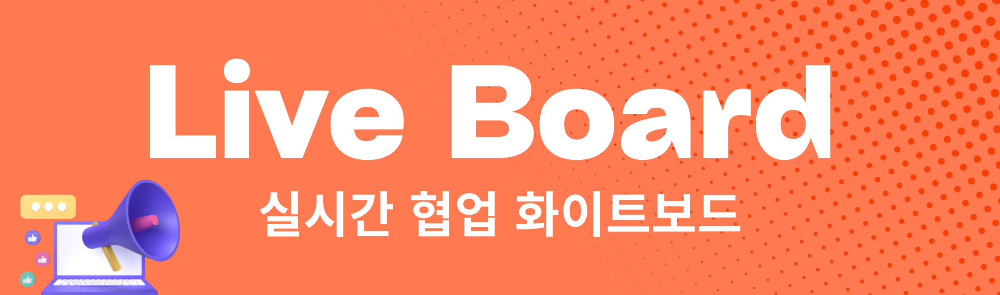
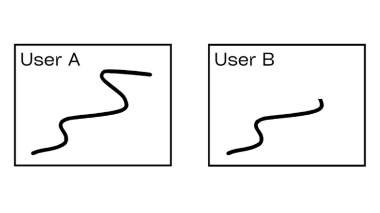
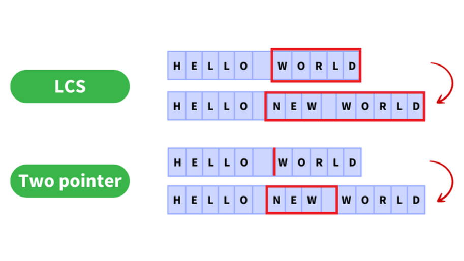
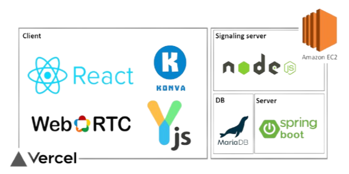
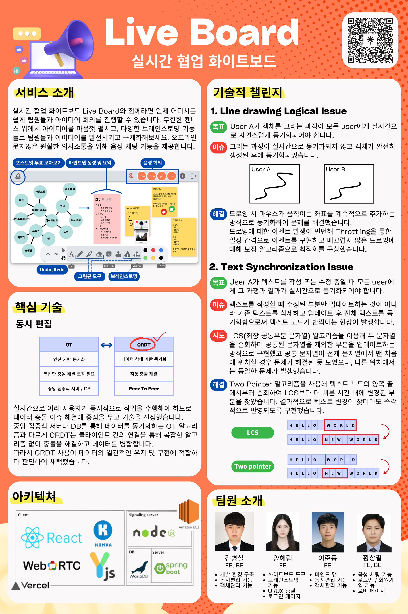

# Live Board
## 크래프톤 정글 3기 🥔 105호 2조 감자밭 🥔 

<!-- PROJECT LOGO -->
<div align="center">
  <a href="https://highlighters.site/" target="_blank">
    
  </a>

  <p align="center">
    <b>실시간 협업 화이트보드 Live Board와 함께 언제 어디서든 쉽게 팀원들과 아이디어 회의를 진행하세요!</b>
  </p>
</div>

<!-- TABLE OF CONTENTS -->
## 목차

1. [프로젝트 개요](#LiveBoard)
2. [서비스 소개](#Intro)
3. [핵심 기술](#CRDT)
4. [기술적 챌린지](#Challenge)
5. [기술 스택 & 시스템 아키텍쳐](#Arch) <!-- todo -->
6. [프로젝트 실행 방법](#Run)  <!-- todo -->
7. [디렉터리 구조](#Directory)
8. [프로젝트 포스터](#Poster)

<br/>
<a name="LiveBoard"> </a>

## 1️⃣ 프로젝트 개요

### 📍 프로젝트 기간
<b>2024.01.11. ~ 2024.02.24 (5주)</b>

### 📍 팀원 소개
<div>
  <table align="center">
    <tr>
      <td height="40px" align="center"><a href="https://github.com/bckim9489">김병철</a></td>
      <td height="40px" align="center"><a href="https://github.com/hyrmzz1">양혜림</a></td>
      <td height="40px" align="center"><a href="https://github.com/junyonglee0223">이준용</a></td>
      <td height="40px" align="center"><a href="https://github.com/piu0887">황상필</a></td>
    </tr>
    <tr>
      <td height="40px" align="center">BE, FE<br>TL</td>
      <td height="40px" align="center">FE</td>
      <td height="40px" align="center">FE</td>
      <td height="40px" align="center">BE, FE</td>
    </tr>
    <tr>
      <td height="40px">
        <ul>
        <li>개발 환경 구축</li>
        <li>동시 편집 기능</li>
        <li>객체 관리 기능</li>
        </ul>
      </td>
      <td height="40px">
        <ul>
        <li>화이트보드 도구</li>
        <li>브레인스토밍 기능</li>
        <li>UI/UX 총괄</li>
        <li>로그인 페이지</li>
        </ul>
      </td>
      <td height="40px">
        <ul>
        <li>마인드맵</li>
        <li>동시 편집 기능</li>
        <li>객체 관리 기능</li>
        </ul>
      </td>
      <td height="40px">
        <ul>
        <li>음성 채팅 기능</li>
        <li>로그인, 회원가입 기능</li>
        <li>로비 페이지</li>
        </ul>
      </td>
    </tr>
  </table>
</div>


<br/>
<a name="Intro"> </a>

## 2️⃣ 서비스 소개

<!-- TODO: gif로 프로젝트 캡쳐본 넣기 (./src/assets/readme 내부에 gif 저장) -->
### 1. 화이트보드 도구
- 펜, 하이라이터, 지우개, 텍스트, 도형을 이용할 수 있습니다.
  <table border="0" >
    <tr>
        <td> </img></td>
        <td></img></td>
    </tr>
  </table>


### 2. 동시 편집
- 같은 방에 있는 모든 사용자에게 모든 작업이 실시간으로 반영됩니다.
  <table border="0" >
    <tr>
        <td> </img></td>
        <td></img></td>
    </tr>
  </table>

- 다른 사용자가 수정 중인 영역에 접근해 수정 또는 삭제할 수 없습니다.
  <table border="0" >
    <tr>
        <td> </img></td>
        <td></img></td>
    </tr>
  </table>


### 3. 마인드맵 생성 및 요약
- 마인드맵을 생성하고 팀원들과 마인드맵을 확장 및 수정할 수 있습니다.
  <table border="0" >
    <tr>
        <td> </img></td>
        <td></img></td>
    </tr>
  </table>

- 마인드맵을 텍스트로 요약할 수 있습니다.
  <table border="0" >
    <tr>
        <td>    </img></td>
        <td>     </img></td>
    </tr>
  </table>


### 4. 포스트잇 생성 및 투표
- 포스트잇을 이용할 수 있습니다.
  <table border="0" >
    <tr>
        <td> </img></td>
        <td></img></td>
    </tr>
  </table>

- 포스트잇 위에 스탬프를 찍어 투표를 진행할 수 있습니다.
- 투표 결과는 한 곳에서 확인 가능합니다.
  <table border="0" >
    <tr>
        <td> </img></td>
        <td></img></td>
    </tr>
  </table>

- 돋보기 아이콘을 눌러 해당 포스트잇을 자세히 볼 수 있습니다.
  <table border="0" >
    <tr>
      <td> </img>
      </td>
      <td>
       </img>
      </td>
    </tr>
  </table>

### 5. 음성 회의
- 팀원들과 음성 채팅을 할 수 있습니다.
   </img>


<br/>
<a name="CRDT"> </a>

## 3️⃣ 핵심 기술
### 📍 동시 편집
실시간으로 여러 사용자가 동시적으로 작업을 수행해야 하므로 <b>데이터 충돌 이슈 해결에 중점을 두고 기술을 선정</b>했습니다.
<br />
<div>
  <table align="center" border="1">
    <tr>
      <td height="40px" align="center"><b>OT</b></td>
      <td height="40px" align="center"><b>CRDT</b></td>
    </tr>
    <tr>
      <td height="40px" align="center">연산 기반 동기화</td>
      <td height="40px" align="center"><b>데이터 상태 기반 동기화</b></td>
    </tr>
    <tr>
      <td height="40px" align="center">복잡한 충돌 해결 로직 필요</td>
      <td height="40px" align="center"><b>자동 충돌 해결</b></td>
    </tr>
    <tr>
      <td height="40px" align="center">중앙 집중식 서버 / DB</td>
      <td height="40px" align="center"><b>Peer To Peer</b></td>
    </tr>
  </table>
</div>

#### CRDT
- 중앙 집중식 서버나 DB를 통해 데이터를 동기화하는 OT 알고리즘과 다르게 <br/><b>CRDT는 클라이언트 간의 연결을 통해 복잡한 알고리즘 없이 충돌을 해결하고 데이터를 병합합니다.</b>
- <b>따라서 CRDT 사용이 데이터의 일관적인 유지 및 구현에 적합하다 판단하여 채택했습니다.</b>


<br/>
<a name="Challenge"></a>

## 4️⃣ 기술적 챌린지

### 📍 Line drawing logical issue

#### 목표
User A가 객체를 그리는 과정이 모든 user에게 실시간으로 자연스럽게 동기화되어야 합니다.

#### 이슈
그리는 과정이 실시간으로 동기화되지 않고 객체가 완전히 생성된 후에 동기화되었습니다.
<!-- <div align="center">
  
</div> -->

#### 해결
드로잉 시 마우스가 움직이는 좌표를 계속적으로 추가하는 방식으로 동기화하여 문제를 해결했습니다.<br />
드로잉에 대한 이벤트 발생이 빈번해 Throttling을 통한 일정 간격으로 이벤트를 구현하고 매끄럽지 않은 드로잉에 대해 보정 알고리즘으로 최적화를 구상했습니다.<br />
<br/>

### 📍 Text synchronization issue


#### 목표
User A가 텍스트를 작성 또는 수정 중일 때 모든 user에게 그 과정과 결과가 실시간으로 동기화되어야 합니다.

#### 이슈
텍스트를 작성할 때 수정된 부분만 업데이트하는 것이 아니라 기존 텍스트를 삭제하고 업데이트 후 전체 텍스트를 동기화함으로써 텍스트 노드가 반짝이는 현상이 발생합니다.

#### 시도
<b>LCS(최장 공통부분 문자열) 알고리즘을 이용</b>해 두 문자열을 순회하며 공통된 문자열을 제외한 부분을 업데이트하는 방식으로 구현했습니다. <br />
공통 문자열이 전체 문자열에서 맨 처음에 위치할 경우 문제가 해결되었으나, 다른 위치에서는 동일한 문제가 발생했습니다. 

#### 해결
<b>Two Pointer 알고리즘을 이용</b>해 텍스트 노드의 양쪽 끝에서부터 순회하여 LCS보다 더 빠른 시간 내에 변경된 부분을 찾았습니다. <br />
결과적으로 텍스트 변경이 잦더라도 즉각적으로 반영되도록 구현했습니다.

<div align="center">
  
</div>


<br />
<a name="Arch"></a>

## 5️⃣ 기술 스택 & 시스템 아키텍쳐

### 📍 기술 스택

**Language**
<div align="left">
  
  
</div>
<br />

**Framework**
<div align="left">
   
  
  
</div>
<br />

**Server**
<div align="left">
  
  
  
</div>
<br />

**DB**
<div align="left">
  
  
</div>
<br />

**Library**
<div align="left">
  
  
</div>
<br />

**Collaboration Tool**
<div align="left">
  
  
  
  
</div>
<br />

### 📍 시스템 아키텍쳐
<div align="center">
  
</div>


<br />
<a name="Run"></a>

## 6️⃣ 프로젝트 실행 방법

### Client
```bash
npm run dev 
```

### Server
```bash
cd /live-voard/bin
# for Linux

PORT=1235 node ./server.js
# for windows

SET PORT=1235
node ./server.js
```

<br />
<a name="Directory"></a>

## 7️⃣ 디렉터리 구조

<details>
<summary><strong>디렉터리 구조 확인하기</strong></summary>

```
live-board
├─ .eslintrc.cjs
├─ .gitignore
├─ bin
│  ├─ callback.js
│  ├─ server.js
│  └─ utils.js
├─ index.html
├─ LICENSE
├─ package-lock.json
├─ package.json
├─ public
│  ├─ LCSWorker.js
│  └─ vite.svg
├─ README.md
├─ src
│  ├─ App.tsx
│  ├─ assets
│  │  ├─ cursor.svg
│  │  ├─ eraser.svg
│  │  ├─ highlighter.svg
│  │  ├─ liveBoardLogo.png
│  │  ├─ mindmap.svg
│  │  ├─ pen.svg
│  │  ├─ postit.svg
│  │  ├─ PotatoFieldLogoLong.png
│  │  ├─ PotatoFieldLogoSquare.png
│  │  ├─ react.svg
│  │  ├─ readme
│  │  │  ├─ lineDrawingIssue.png
│  │  │  ├─ liveBoardArchitecture.png
│  │  │  ├─ liveBoardLogoReadme.png
│  │  │  ├─ liveBoardPoster.png
│  │  │  └─ textSyncIssue.png
│  │  ├─ shapes.svg
│  │  ├─ signupLogo.png
│  │  ├─ stamp.svg
│  │  ├─ text.svg
│  │  ├─ thumbdown.png
│  │  └─ thumbup.png
│  ├─ component
│  │  ├─ ButtonCustomGroup.module.css
│  │  ├─ ButtonCustomGroup.tsx
│  │  ├─ ColorContext.tsx
│  │  ├─ Connector.ts
│  │  ├─ contextMenu.css
│  │  ├─ Copyright.tsx
│  │  ├─ Cursor.tsx
│  │  ├─ EditableText.tsx
│  │  ├─ Eraser.tsx
│  │  ├─ Hand.tsx
│  │  ├─ MindMap.tsx
│  │  ├─ MindMapIndex.tsx
│  │  ├─ NavBarLobby.tsx
│  │  ├─ NavBarRoom.tsx
│  │  ├─ Pen.tsx
│  │  ├─ PostIt.tsx
│  │  ├─ Shape.tsx
│  │  ├─ ShapeOrder.ts
│  │  ├─ Stamp.tsx
│  │  ├─ Target.ts
│  │  ├─ Text.tsx
│  │  ├─ TextEditor.tsx
│  │  ├─ ToolContext.tsx
│  │  ├─ Tools.ts
│  │  ├─ UserShape.ts
│  │  ├─ voicechat
│  │  │  ├─ appId.tsx
│  │  │  ├─ voiceAgora.tsx
│  │  │  ├─ voicechat.tsx
│  │  │  └─ voiceserver.js
│  │  ├─ VoteDrawer.module.css
│  │  └─ VoteDrawer.tsx
│  ├─ image
│  │  ├─ addbutton.png
│  │  ├─ imageSample10.png
│  │  ├─ imageSample3.png
│  │  ├─ imageSample4.png
│  │  ├─ imageSample5.png
│  │  ├─ imageSample6.png
│  │  ├─ imageSample7.png
│  │  ├─ imageSample8.png
│  │  ├─ imageSample9.png
│  │  └─ imageSampleMain.png
│  ├─ index.css
│  ├─ lobby.tsx
│  ├─ login.tsx
│  ├─ main.tsx
│  ├─ signup.tsx
│  └─ vite-env.d.ts
├─ tsconfig.json
├─ tsconfig.node.json
└─ vite.config.ts

```
</details>

<br />
<a name="Poster"> </a>

## 8️⃣ 프로젝트 포스터


